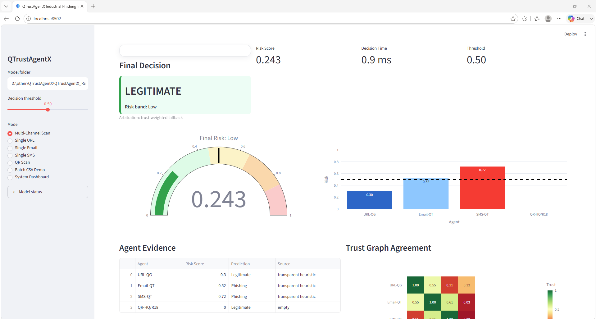
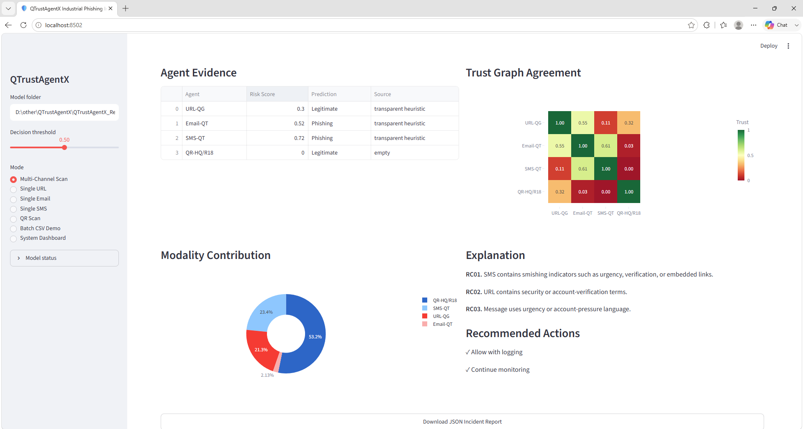
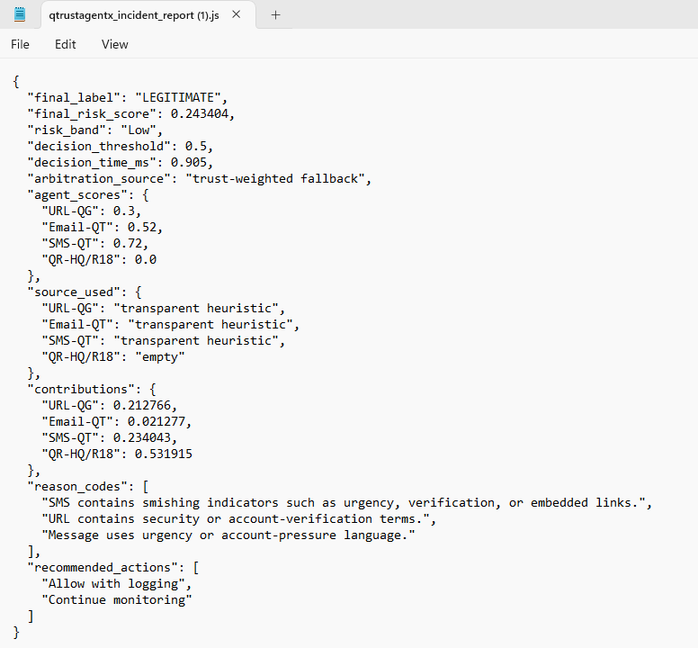

# QTrustAgentX Industrial GUI Application

<p align="center">
  
</p>

<p align="center">
<b>Interactive Explainable Multi-Modal Phishing Detection System</b><br>
URL • Email • SMS • QR • Agentic Arbitration • Trust Graph • Explainable AI
</p>

---

# Live Application Demo

<p align="center">
<a href="./qtrustagentx_app_video.mp4">

</a>
</p>

<p align="center">
Click the image above to watch the application demo video.
</p>

**Direct Video Download:** [qtrustagentx_app_video.mp4](./qtrustagentx_app_video.mp4)

---

# Application Features

The QTrustAgentX GUI implements the complete architecture proposed in our paper.

### Multi-Modal Evidence Acquisition
- URL inspection
- Email phishing analysis
- SMS smishing detection
- Malicious QR code analysis

### Specialist Agent Layer
- URL Quantum-Graph Agent
- Email Quantum-Text Agent
- SMS Quantum-Text Agent
- QR Specialist Agent

### Agentic Arbitration Layer
- Majority Voting
- Risk Arbitration
- Quantum Arbitration

### Explainable AI
- Agent risk scores
- Evidence contribution analysis
- Trust agreement graph
- Reason codes
- Recommended actions
- Incident report generation

---

# GUI Workflow

```
Evidence Input
      ↓
Specialist Agents
      ↓
Risk Scoring
      ↓
Trust Graph Construction
      ↓
Quantum Arbitration
      ↓
Explainable Decision
      ↓
Incident Report Export
```

---

# Application Screens

## Dashboard

<p align="center">

</p>

The dashboard allows analysts to submit URLs, emails, SMS messages, and QR images for inspection.

---

## Agent Evidence Analysis

<p align="center">

</p>

The system displays:

- Risk gauge
- Agent confidence
- Specialist predictions
- Arbitration score

---

## Trust Graph and Explainability

<p align="center">

</p>

The interface visualizes:

- Agent agreement matrix
- Modality contribution
- Reason codes
- Threat explanations

---

## Incident Response and Reporting

<p align="center">

</p>

The application generates:

- Final verdict
- Risk category
- Response recommendations
- JSON incident reports
- Analyst-ready summaries

---

# Running the Application

## Create Environment

```bash
conda create -n qtrustagentx_app python=3.11 -y
conda activate qtrustagentx_app
```

## Install Dependencies

```bash
pip install streamlit
pip install pandas numpy scikit-learn
pip install plotly pillow
pip install torch torchvision
pip install joblib
```

---

# Launch Application

```bash
cd GUIApp
streamlit run qtrustagentx_app.py
```

The browser automatically opens:

```text
http://localhost:8501
```

---

# Required Model Directory

```text
QTrustAgentX_Results/
└── models/
    ├── URL_QuantumGraph_Agent.joblib
    ├── EMAIL_QuantumText_Agent.joblib
    ├── SMS_QuantumText_Agent.joblib
    ├── QR_Handcrafted_Quantum.joblib
    ├── QR_ResNet18_Agent.pt
    ├── Agentic_MajorityVote_Baseline.joblib
    ├── Agentic_RiskArbitration_X.joblib
    └── Agentic_QuantumArbitration_X.joblib
```

---

# Supported Inputs

| Evidence Type | Accepted Inputs |
|---------------|----------------|
| URL | Direct URL strings |
| Email | Raw email text |
| SMS | SMS messages |
| QR | PNG, JPG, JPEG, BMP, WEBP |

---

# Generated Outputs

- Final phishing verdict
- Unified risk score
- Agent confidence scores
- Trust agreement matrix
- Modality contributions
- Explainability reports
- Recommended mitigation actions
- Downloadable incident reports

---

# Repository Structure

```
GUIApp/
├── qtrustagentx_app.py
├── qtrustagentx_app_video.mp4
├── q1.png
├── q2.png
├── q3.png
├── q4.png
└── readme.md
```

---

# Citation

If you use this application, please cite the accompanying QTrustAgentX paper and repository.
