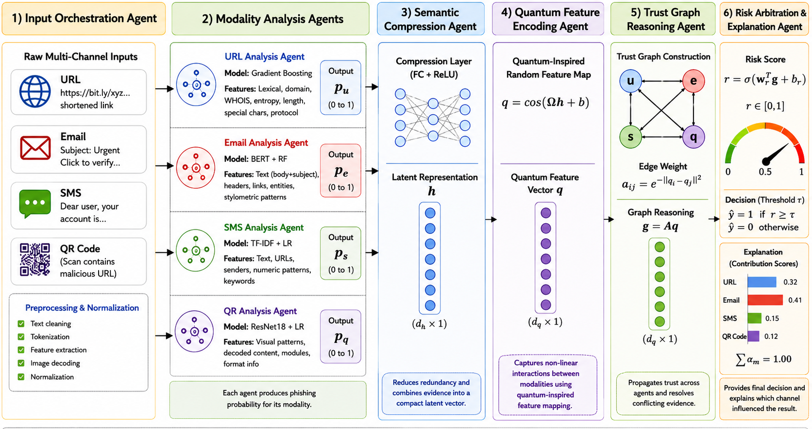
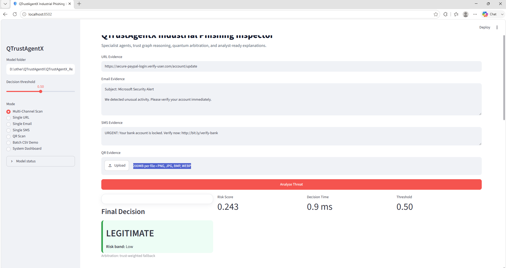

# QTrustAgentX

# Explainable Multi-Channel Phishing Detection Through Agentic Decision Arbitration, Quantum-Inspired Representation Learning, and Trust Graph Modeling

Official implementation of the IEEE Open Journal of the Computer Society paper.

---

# Abstract

Phishing attacks increasingly exploit URLs, emails, SMS messages, QR codes, and AI-generated content, which limits the effectiveness of single-channel detectors and static rule-based systems. QTrustAgentX introduces an explainable multi-channel phishing detection framework that integrates modality-specific agents, semantic compression, quantum-inspired representation learning, trust graph reasoning, and risk-aware decision arbitration. Experiments demonstrate strong modality performance, including an F1-score of 0.9995 for QR analysis, 0.9925 for semantic email compression, and 0.9621 for URL detection. The framework remains stable under progressively poisoned evidence and produces interpretable modality contribution scores suitable for deployment in email gateways, browser security extensions, secure messaging platforms, and enterprise phishing monitoring systems.

---

# Research Motivation

Modern phishing campaigns rarely rely on a single communication channel. Attackers increasingly combine:

- Malicious URLs
- AI-generated phishing emails
- SMS smishing campaigns
- QR-code phishing attacks
- Multi-stage social engineering attacks

Existing phishing detectors generally focus on only one modality and cannot reason over conflicting evidence originating from heterogeneous communication channels.

---

# Research Gaps

Current phishing detection literature exhibits several limitations:

- Single-modality learning
- Limited cross-channel reasoning
- Lack of adaptive decision arbitration
- Limited explainability
- Minimal robustness analysis
- Limited evaluation against AI-generated phishing attacks
- Absence of unified multi-agent architectures

---

# Literature Comparison

| Study | Multimodal | Agentic AI | Graph Reasoning | Quantum Inspired | Explainable |
|-------|------------|------------|-----------------|-----------------|-------------|
| Wang and Gonsalves | ✓ | ✗ | ✗ | ✗ | Partial |
| Kavya and Sumathi | ✓ | ✗ | ✓ | ✗ | ✗ |
| Chen et al. | ✓ | ✗ | ✗ | ✗ | ✗ |
| Khandan et al. | ✓ | ✗ | ✗ | ✗ | ✓ |
| Vijetha | ✗ | ✓ | Partial | ✗ | Partial |
| Proposed QTrustAgentX | ✓ | ✓ | ✓ | ✓ | ✓ |

---

# Proposed Architecture

<p align="center">

</p>

QTrustAgentX consists of:

1. Input Orchestration Agent
2. URL Analysis Agent
3. Email Analysis Agent
4. SMS Analysis Agent
5. QR Analysis Agent
6. Semantic Compression Agent
7. Quantum Feature Encoding Agent
8. Trust Graph Reasoning Agent
9. Risk Arbitration and Explanation Agent

---

# Key Contributions

- Unified phishing detection across URLs, emails, SMS messages, and QR codes
- Agentic decision arbitration
- Quantum-inspired nonlinear feature learning
- Trust graph reasoning
- Explainable modality attribution
- Robustness analysis under poisoned evidence
- Evaluation against human-generated and LLM-generated phishing attacks

---
## QTrustAgentX Industrial GUI Application

The repository includes an interactive Streamlit application that demonstrates the proposed QTrustAgentX system in an analyst-friendly interface. The app supports URL, email, SMS, and QR evidence input, then displays specialist agent scores, trust-graph agreement, quantum arbitration output, explainability reason codes, recommended response actions, and a downloadable incident report.

### Live Application Demo

<p align="center">
<a href="./GUIApp/qtrustagentx_app_video.mp4">

</a>
</p>

<p align="center">
Click the image above to watch the application demo video.
</p>

**Direct Video Download:** [qtrustagentx_app_video.mp4](./GUIApp/qtrustagentx_app_video.mp4)

---

### Run the GUI Application

```bash
conda create -n qtrustagentx_app python=3.11 -y
conda activate qtrustagentx_app

pip install streamlit pandas numpy scikit-learn plotly pillow torch torchvision joblib

cd GUIApp
streamlit run qtrustagentx_app.py
---
# Repository Structure

```text
QTrustAgentX/
│
├── Code/
├── Dataset/
├── Results/
├── qtrustagentx_architecture_1080p.png
├── qtrustagentx_agent_evidence_analysis.png
├── README.md
└── LICENSE
```

---

# Dataset Summary

| Dataset | Rows | Columns | Duplicates | Missing Cells | Label Column | Text Column |
|---------|------:|---------:|------------:|---------------:|--------------|-------------|
| url_phishing_11430_89features.csv | 11,430 | 89 | 0 | 0 | status | url |
| sms_phishing_5971.csv | 5,971 | 5 | 17 | 0 | LABEL | TEXT |
| human_legit_email_1000.csv | 1,000 | 7 | 0 | 16 | label | body |
| human_phishing_email_1000.csv | 1,000 | 7 | 496 | 24 | label | body |
| llm_legit_email_1000.csv | 1,000 | 2 | 2 | 0 | label | text |
| llm_phishing_email_595.csv | 595 | 2 | 429 | 631 | label | text |
| dataset_manifest.csv | 10 | 2 | 0 | 0 | dataset_type | path |
| phishing_intent_category_1000.csv | 1,000 | 3 | 921 | 0 | category | text |
| sms_spam_raw_duplicate_check.csv | 5,572 | 5 | 403 | 16,648 | v1 | v2 |
| dataset_links.txt | 8 | 1 | 0 | 0 | N/A | N/A |

QR corpus:
- 100,000 benign QR images
- 100,000 malicious QR images

# Dataset Statistics

| Dataset | Samples | Features |
|---------|---------:|---------:|
| URL Phishing Dataset | 11,430 | 89 |
| SMS Phishing Dataset | 5,971 | 5 |
| Human Legitimate Emails | 1,000 | 7 |
| Human Phishing Emails | 1,000 | 7 |
| LLM Legitimate Emails | 1,000 | 2 |
| LLM Phishing Emails | 595 | 2 |
| QR Benign Images | 100,000 | Images |
| QR Malicious Images | 100,000 | Images |

---

# Dataset Quality Report

| Dataset | Duplicates | Missing Values |
|---------|------------:|---------------:|
| SMS Phishing | 17 | 0 |
| Human Phishing Emails | 496 | 24 |
| LLM Phishing Emails | 429 | 631 |
| SMS Spam Raw | 403 | 16,648 |

---

# Environment Setup

```bash
conda create -n qtrustagentx python=3.11 -y
conda activate qtrustagentx

pip install pandas numpy scipy scikit-learn matplotlib seaborn
pip install pillow tqdm openpyxl joblib networkx shap lime
pip install torch torchvision torchaudio
```

---

# Reproducing the Paper

Dataset preparation:

```bash
python reorganize_dataset.py
python profile_reorganized_dataset.py
python deep_dataset_inspector.py
python inspect_datasets.py
```

Run complete experiments:

```bash
python qtrustagentx_final_pipeline.py --mode all
```

---

# Main Experimental Results

| Experiment | Accuracy | F1 | AUC |
|------------|----------:|---:|----:|
| QR Specialist | 0.9995 | 0.9995 | 1.0000 |
| Email Compression | 0.9958 | 0.9925 | 0.9997 |
| URL Detection | 0.9619 | 0.9621 | 0.9936 |
| Quantum Arbitration | 0.7713 | 0.7727 | 0.8852 |

---

# Ablation Studies

### Agentic Orchestration
### Quantum and Graph Reasoning
### Modality Contribution
### Human vs LLM Generalization
### Robustness to Poisoned Evidence
### Explainability Faithfulness

---

## Agent Evidence Analysis

<p align="center">

</p>

## Additional Results

- ROC curves
- Confusion matrices
- Modality contribution plots
- Poisoned evidence robustness plots
- Explainability figures
- Agent reliability plots

---

# Citation

```bibtex
@article{khan2025qtrustagentx,
  title={QTrustAgent-X: Explainable Multi-Channel Phishing Detection Through Agentic Decision Arbitration, Quantum-Inspired Representation Learning, and Trust Graph Modeling},
  author={Khan, Misha Urooj and Suleman, Ahmad and Adarbah, Haitham},
  journal={IEEE Open Journal of the Computer Society},
  year={2025}
}
```

---

# License

Apache License 2.0

---

# Contact

Misha Urooj Khan  
European Organization for Nuclear Research (CERN), Geneva, Switzerland

Research Interests:
Artificial Intelligence, Quantum Machine Learning, Cybersecurity, Generative AI, Large Language Models, Deep Learning, IoT, and Autonomous Systems.
